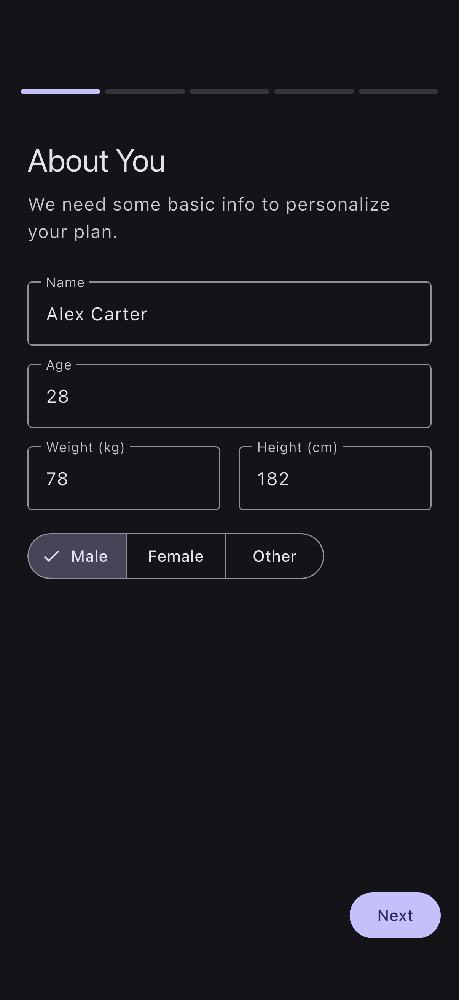
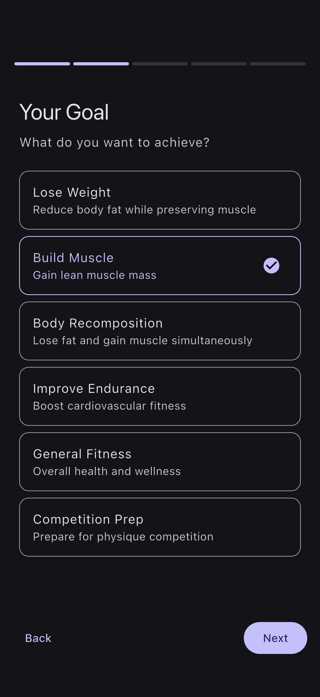
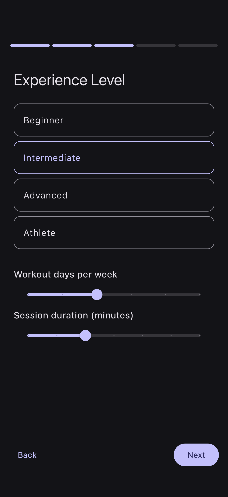
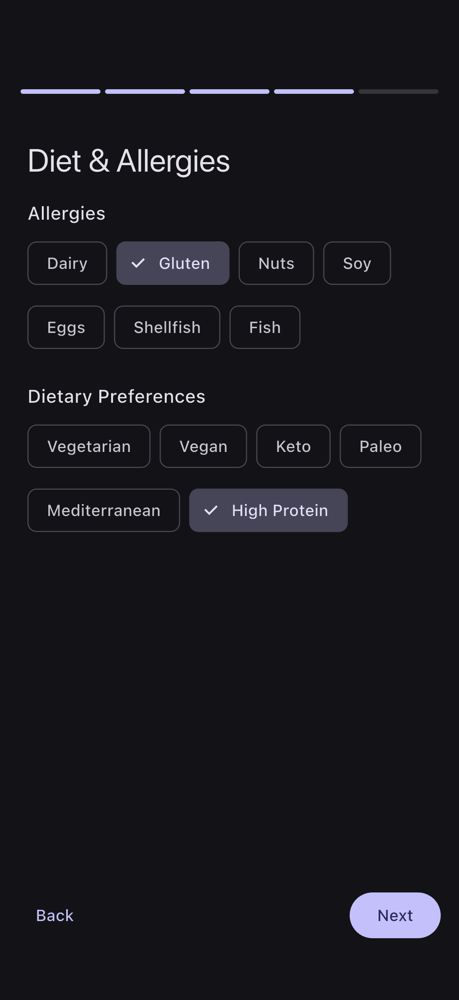
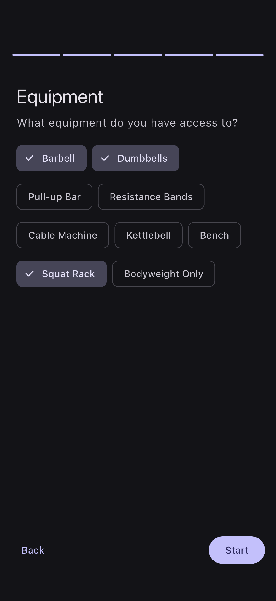
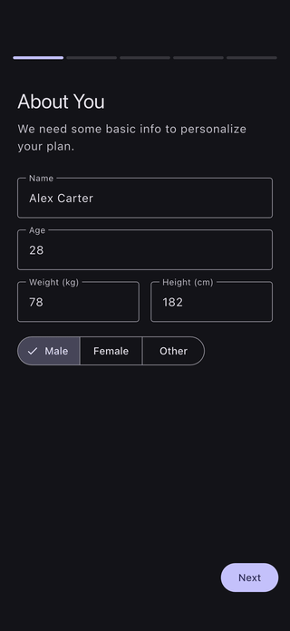

# Fitness AI CV

An AI-powered fitness coaching POC built with Flutter and Riverpod. The app onboards a user with their stats, goal, experience, diet, and equipment, then uses on-device ML Kit pose detection plus a Claude vision call to analyze physique photos (front, side, back) and generate a personalized body-composition assessment with workout and meal plans.

## Demo

These are real iOS-Simulator captures from the running app, generated via an integration-test driver (no mockups). See [FLOW.md](FLOW.md) for how they are produced.

| About You | Your Goal | Experience |
| --- | --- | --- |
|  |  |  |

| Diet & Allergies | Equipment |
| --- | --- |
|  |  |

## Features

- Multi-step onboarding: stats, fitness goal, experience level, training-volume sliders, diet/allergy chips, equipment selection.
- Computer-vision physique analysis: ML Kit pose-landmark extraction from front/side/back photos.
- AI body-composition assessment: pose landmarks plus base64 images sent to Claude for body-fat, muscle-development, and fat-distribution scoring.
- Personalized workout and meal plan generation, weekly check-ins, and an AI coach chat.
- Local persistence with Hive; progress charts with fl_chart.

## Stack

- Flutter, Dart
- Riverpod (state management)
- go_router (navigation)
- google_mlkit_pose_detection (computer vision)
- Claude API (vision analysis)
- Hive (local storage), fl_chart (charts)
