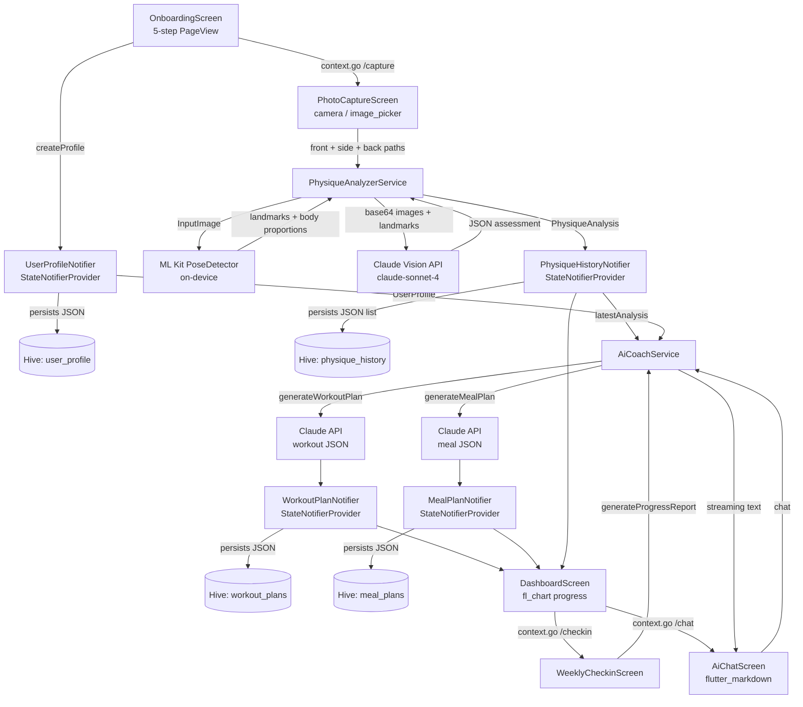

# flutter-fitness-ai-cv

An AI-powered fitness coaching POC built with **Flutter**, **Riverpod**, and **go_router**. The app guides a user through a 5-step onboarding flow (stats, goal, experience, diet, equipment), then uses on-device **ML Kit pose detection** plus a **Claude vision API** call to analyze front, side, and back physique photos and generate a personalized body-composition assessment with workout and meal plans stored locally via **Hive**.

## Demo

Real iOS Simulator captures from the running app, generated via an integration-test driver (no mockups).


## Screenshots

| About You | Your Goal | Experience |
| --- | --- | --- |
|  |  |  |

| Diet & Allergies | Equipment |
| --- | --- |
|  |  |

## Features

- 5-step onboarding: basic stats (name, age, weight, height, gender), fitness goal picker, experience level + training-volume sliders, diet/allergy filter chips, equipment selection chips.
- Computer-vision physique analysis: ML Kit pose-landmark extraction from front, side, and back photos; shoulder/waist/hip/limb proportions calculated from detected landmarks.
- AI body-composition assessment: pose landmarks plus base64 JPEG images sent to Claude (claude-sonnet-4) for body-fat percentage, category, per-muscle-group development scores (1-10), fat-distribution pattern, measurement estimates, strengths, and areas for improvement.
- AI workout plan generation: Claude generates a structured weekly plan with exercises, sets, reps, rest periods, warm-up/cool-down notes, and progressive overload across weeks.
- AI meal plan generation: Claude generates a 7-day plan with daily macro targets, per-meal food items, prep notes, and a shopping list, respecting user allergies and dietary preferences.
- Weekly check-in and progress report: Claude compares two physique analyses and produces a written progress assessment.
- AI coach chat: real-time conversation with Claude, context-aware of the user's profile and latest analysis.
- Local persistence: all profiles, plans, and physique history stored in Hive boxes; progress charts rendered with fl_chart.

## Stack

- **Flutter 3**, Dart SDK >= 3.2
- **flutter_riverpod** 2.5 - state management via `StateNotifierProvider` and `Provider`
- **go_router** 14 - declarative routing (6 named routes)
- **google_mlkit_pose_detection** 0.11 - on-device pose landmark extraction
- **Claude API** (claude-sonnet-4) via **http** - vision analysis, workout/meal plan generation, coach chat
- **Hive** 2 + hive_flutter - local NoSQL boxes: `user_profile`, `workout_plans`, `meal_plans`, `physique_history`
- **fl_chart** 0.68 - progress charts on the dashboard
- **image_picker**, **camera** - photo capture
- **flutter_markdown** - renders AI coach responses
- **uuid**, **intl**, **path_provider**, **permission_handler** - utilities

## Architecture

```
flutter-fitness-ai-cv/
lib/
  main.dart                  # ProviderScope + GoRouter setup + Hive init
  models/
    user_profile.dart        # UserProfile, Gender, FitnessGoal, ExperienceLevel enums
    physique_analysis.dart   # PhysiqueAnalysis, MuscleDevScores, FatDistribution, BodyProportions
    workout_plan.dart        # WorkoutPlan, WorkoutDay, Exercise, ExerciseType enums
    meal_plan.dart           # MealPlan, MealDay, Meal, FoodItem, MacroTargets
  providers/
    fitness_provider.dart    # All StateNotifierProviders and Providers
  screens/
    onboarding_screen.dart   # 5-page PageView onboarding (implemented)
    photo_capture_screen.dart  # (route defined, file WIP)
    analysis_screen.dart       # (route defined, file WIP)
    dashboard_screen.dart      # (route defined, file WIP)
    weekly_checkin_screen.dart # (route defined, file WIP)
    ai_chat_screen.dart        # (route defined, file WIP)
  services/
    physique_analyzer.dart   # ML Kit pose detection + Claude vision call
    ai_coach.dart            # Workout plan, meal plan, progress report, chat via Claude API
integration_test/
  screenshot_test.dart       # Integration-test driver for onboarding screenshots
test_driver/
  integration_test.dart      # flutter drive entry point
```



## Mock data

There is no static mock backend. All AI-generated data (physique analysis, workout plans, meal plans, coach responses) is fetched live from the Claude API using the key set via `PhysiqueAnalyzerService.setApiKey()` and `AiCoachService.setApiKey()`. Persistence is entirely local through Hive.

The integration-test driver seeds the following realistic onboarding data to make the 5-step UI fully demoable without a real user typing:

| Field | Seeded value |
| --- | --- |
| Name | Alex Carter |
| Age | 28 |
| Weight | 78 kg |
| Height | 182 cm |
| Goal | Build Muscle |
| Diet preference | High Protein |
| Allergy | Gluten |
| Equipment | Barbell, Dumbbells, Squat Rack |

The `OnboardingScreen` contains fixed chip option lists (allergies: Dairy, Gluten, Nuts, Soy, Eggs, Shellfish, Fish; diets: Vegetarian, Vegan, Keto, Paleo, Mediterranean, High Protein; equipment: Barbell, Dumbbells, Pull-up Bar, Resistance Bands, Cable Machine, Kettlebell, Bench, Squat Rack, Bodyweight Only) that are available without a network call.

## Run

```bash
flutter pub get
flutter run -d "iPhone 17 Pro"
```

A Claude API key is required before the physique analysis and plan-generation screens become functional. Pass it to the service instances via `setApiKey(key)` - the key is intentionally not hard-coded; load it from secure storage or a `.env` file in production.
